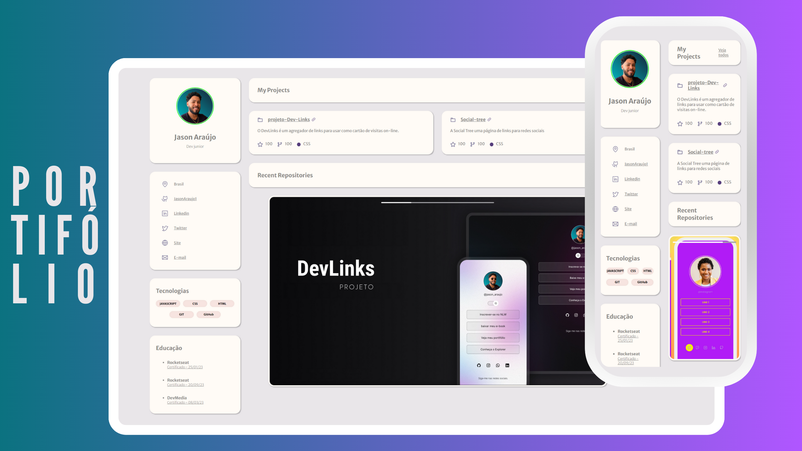

<h1 align="center">#4 Portifólio </h1>

Este é um projeto de portifólio, onde compartilho algumas informações sobre mim e os projetos que desenvolvi. 

  <a href="#-tecnologias">Tecnologias</a>&nbsp;&nbsp;&nbsp;|&nbsp;&nbsp;&nbsp;
  <a href="#-projeto">Projeto</a>&nbsp;&nbsp;&nbsp;|&nbsp;&nbsp;&nbsp;
  <a href="#-layout">Layout</a>&nbsp;&nbsp;&nbsp;|&nbsp;&nbsp;&nbsp;
  <a href="#memo-licença">Licença</a>

  

 

  

## 🚀 Tecnologias

Esse projeto foi desenvolvido com as seguintes tecnologias:

- HTML e CSS
- JavaScript
- Git e Github
- Canva
- Figma

## 💻 Projeto

Olá, seja bem-vindo ao meu projeto de portfólio! Aqui, compartilho um pouco sobre mim e os projetos que tive o prazer de desenvolver ao longo da minha jornada como desenvolvedor. Este espaço é dedicado a apresentar minhas paixões, conquistas e habilidades. Sinta-se à vontade para explorar e conhecer mais sobre mim e os trabalhos que me inspiram.

## 🔖 Layout

- Layout cuidadosamente planejado para aprimorar a experiência visual.

- Elementos dispostos de forma intuitiva para facilitar a leitura das instruções e visualização das imagens.

- Utilização de cores suaves, imagens e símbolos que criam um ambiente convidativo.

- Incorporação de botões e elementos que oferecem uma experiência de usuário aprimorada.

- Links estrategicamente posicionados que direcionam para certificados, redes sociais, projetos e outras informações relevantes.

- Pré-visualização de thumbnails de alguns projetos, permitindo aos visitantes explorar instantaneamente o trabalho e proporcionando uma experiência aprimorada com o uso da linguagem JavaScript para otimizar o carrossel.

- Você pode visualizar o layout do projeto através [DESSE LINK](<https://jasonaraujo1.github.io/projeto-portifolio/>).

## :memo: Licença

Esse projeto está sob a licença MIT.

---
